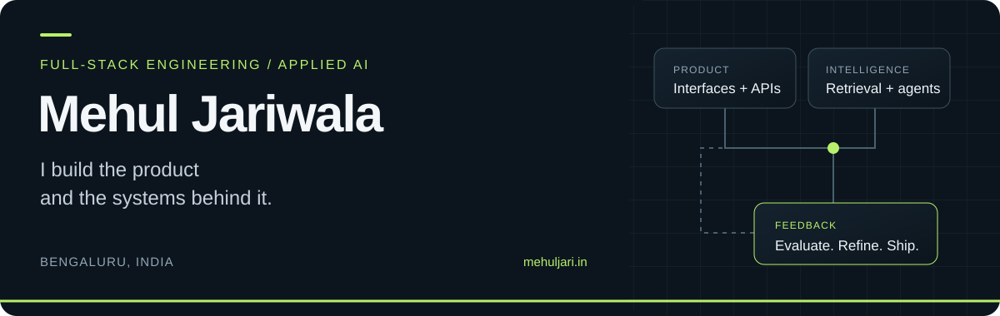

  <picture>
    <source media="(max-width: 600px)" srcset="./assets/profile-header-mobile.svg" />
  
  </picture>

  <a href="https://mehuljari.in"><strong>Portfolio &amp; case studies</strong></a> ·
  <a href="https://www.linkedin.com/in/mehul-jariwala-352a01132/"><strong>LinkedIn</strong></a> ·
  <a href="mailto:mjariwala98@gmail.com"><strong>Email</strong></a> ·
  <a href="https://medium.com/@mjariwala98"><strong>Writing</strong></a>

## I build the product and the systems behind it.

I'm a **full-stack and AI engineer** with experience spanning founding teams and enterprise platforms. I build across the whole product: the interface people use, the services behind it, and the retrieval and agent workflows that connect it to AI.

My work spans **Legal AI at Fasteroutcomes, enterprise engineering at IBM and Publicis Sapient, and founding frontend engineering at Fitbots**. Based in Bengaluru. MCA, university gold medalist.

I care about what happens after the happy path: whether an agent can resume, whether a stream survives interruption, and whether an evaluation actually catches a regression.

## Selected builds

Six places to explore how I approach those problems. The AI repositories include local examples, tests, and design notes; their READMEs describe provider support and limitations.

### 01 / Document experiences in React

**[react-doc-viewer](https://github.com/mehuljariwala/react-doc-viewer)** · TypeScript / React  
A document viewer I maintain and extend from `@cyntler/react-doc-viewer`: PDF search and annotations, local DOCX/XLSX previews, and extensible renderers.  
[Live demo](https://mehuljariwala.github.io/react-doc-viewer/) · [npm package](https://www.npmjs.com/package/@iamjariwala/react-doc-viewer)

### 02 / Retrieval with evidence

**[agentic-rag-platform](https://github.com/mehuljariwala/agentic-rag-platform)** · Python / FastAPI  
Hybrid retrieval, rank fusion, reranking, citation tracing, and retrieval retries. Includes reproducible evaluations and an honest account of where the offline approach falls short.

### 03 / A gateway between applications and models

**[llm-gateway-router](https://github.com/mehuljariwala/llm-gateway-router)** · Go  
Model routing, provider failover, circuit breakers, caching, tenant rate limits, and usage accounting in one gateway.

### 04 / Agents that can pick up where they stopped

**[agent-orchestrator](https://github.com/mehuljariwala/agent-orchestrator)** · Python  
Agent workflows built around durable event logs, replay, cross-process resume, human approval, and budget controls.

### 05 / Evaluation that informs a release

**[llm-eval-harness](https://github.com/mehuljariwala/llm-eval-harness)** · Python  
LLM evaluation with confidence intervals, paired comparisons, deterministic graders, and configurable regression gates for CI.

### 06 / Voice interactions that handle interruption

**[realtime-voice-agent](https://github.com/mehuljariwala/realtime-voice-agent)** · Python / asyncio  
Streaming speech-to-text, model, and text-to-speech primitives. Interruption cancels generation and adjusts history to what the caller actually heard. Local demos use offline providers.

**More frontend work:** [streaming-chat-ui](https://github.com/mehuljariwala/streaming-chat-ui) — TypeScript primitives for SSE parsing, partial tool calls, and streaming chat state.

## Open source, beyond my own repositories

Selected merged contributions:

- **[Meta's Lexical](https://github.com/facebook/lexical/pull/9117)** — notify consumers when selection overlay rectangles are removed.
- **[Elastic UI](https://github.com/elastic/eui/pull/9972)** — migrate `EuiSuperSelect` to a function component.
- **[Prometheus Alertmanager](https://github.com/prometheus/alertmanager/pull/5505)** — improve PagerDuty v1 HTTP error classification.

[Explore my merged pull requests →](https://github.com/search?q=author%3Amehuljariwala+is%3Amerged&type=pullrequests)

## Experience I bring to a team

- **Product ownership:** founding engineering experience across Legal AI and an employee OKR platform.
- **Full-stack delivery:** React and Next.js interfaces, application services, document workflows, and enterprise integrations.
- **Applied AI:** retrieval, orchestration, evaluation, and human review, with attention to failure modes and observability.

<strong>My working toolkit</strong>

- **Languages:** TypeScript, JavaScript, Python, Go, Java
- **Product & APIs:** React, Next.js, Node.js, FastAPI
- **AI & retrieval:** LangGraph, LangChain, RAG, Elasticsearch, vector search
- **Workflows & platforms:** Temporal, Kafka, Docker, Kubernetes, AWS
- **Quality:** automated tests, evaluation suites, CI, and observability

## Notes from building

- [How I would test an AI agent before letting customers use it](https://mehuljari.in/blog/ai-agent-evaluation-release-checklist/) — evaluation around outcomes, forbidden actions, and realistic failures.
- [Your AI agent timed out. Did it still send the refund?](https://mehuljari.in/blog/ai-agent-retries-without-duplicate-actions/) — retries, durable state, and duplicate prevention.

## Let's build something useful.

Hiring for **senior full-stack, applied AI, or agentic systems engineering**? I'd be glad to discuss the product, the technical challenges, and where I could contribute.

**[Start a conversation on LinkedIn](https://www.linkedin.com/in/mehul-jariwala-352a01132/)** · **[Email me](mailto:mjariwala98@gmail.com)** · **[Read the case studies](https://mehuljari.in)**
